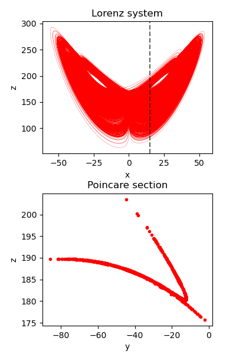
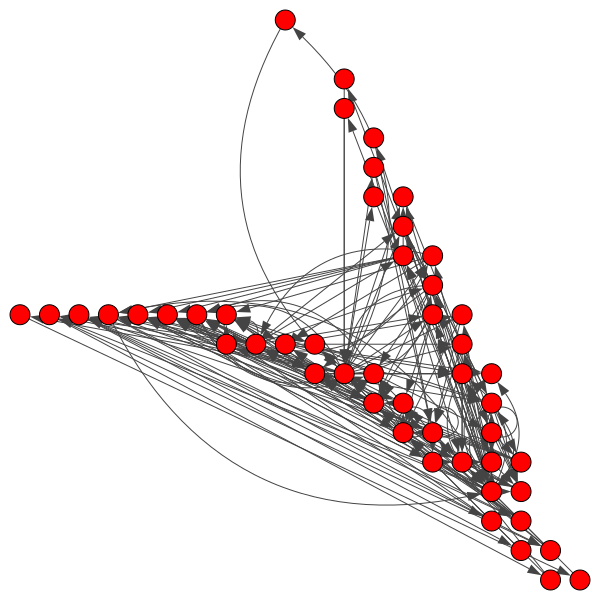

# Lyapunov measure for State-Transition Networks

The repository provides a method to construct State-Transition Networks (STN) from discrete-time or quasi-continuous multivariate time series.
Furthermore it contains an implementation of the Lyapunov measure defined for STNs (as introduced in [article link?]). 

## Constructing State-Transition Networks
State-transition networks can be constructed using the function `STN` from `stn.py`.
Given the time series data and the discretization resolution *b* the function returns a weighted and directed `igraph.Graph` object.
Consider the following example to see the usage in practice.

### Example 1 - STN from Lorenz dynamics
By solving the Lorenz system numerically we obtain a quasi-continuous three-variable time series, which is then reduced to a two-dimensional discrete-time map by taking a Poincare section. This two-dimensional data is then used to construct the STN.

Code excerpt from `example-1-lorenz.py`:

```
    dynamics = lorenz(N=N, dt=dt, sigma=10, beta=8./3, rho=rho, xyz0=xyz0)[:, trans:]
    poin = poincare(dynamics, axis=0, value=section)
    g = STN(poin, 40)
```






## Calculating the Lyapunov network measure

### Example 2 - Lyapunov measure of STNs from the Henon Map

### Example 3 - Lyapunov measure of STNs from the Lorenz system

