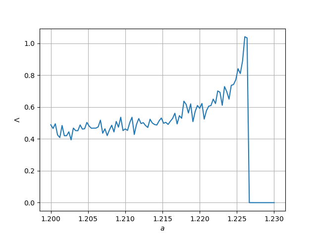
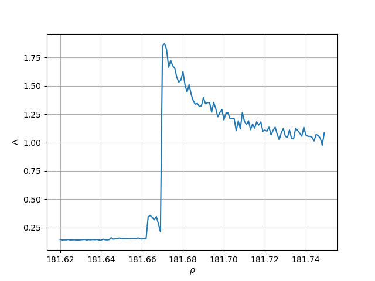

# Lyapunov measure for State-Transition Networks

The repository provides a method to construct State-Transition Networks (STN) from discrete-time or quasi-continuous multivariate time series.
Furthermore it contains an implementation of the Lyapunov measure defined for STNs (as introduced in [article link?]). 

## Constructing State-Transition Networks
State-transition networks can be constructed using the function `STN` from `stn.py`.
Given the time series data and the discretization resolution *b* the function returns a weighted and directed `igraph.Graph` object.
Consider the following example to see the usage in practice.

### Example 1 - STN from Lorenz dynamics
By solving the Lorenz system numerically we obtain a quasi-continuous three-variable time series, which is then reduced to a two-dimensional discrete-time map by taking a Poincare section. This two-dimensional data is then used to construct the STN.

Code excerpt from `example-1-lorenz.py`:

```
    # Generating the Lorenz dynamics
    dynamics = lorenz(N=N, dt=dt, sigma=10, beta=8./3, rho=rho, xyz0=xyz0)[:, trans:]
    
    # Taking the Poincare section
    poin = poincare(dynamics, axis=0, value=section)
    
    # Constructing an STN
    g = STN(poin, b)

```

Running the example should result in plotting the dynamics and the corresponding STN:


## Calculating the Lyapunov network measure
Having an STN the Lyapunov network measure can be calculated by calling `lyapunov_parallel` implemented in module `lyapunov.py`.
In the next two exmaples the Lyapunov measure is computed for STNs constructed from multiple runs of the dynamics with varying control parameters.
The parameter ranges are chosen so that the unique peaking behaviour of the Lyapunov measure can be observed near the transition of the chaotic and periodic regime.

### Example 2 - Lyapunov measure of STNs from the Henon Map
In `example-2-henon.py` the Henon map is iterated with different *a* control parameters to build STNs, then the Lyapunov measure is calculated for every graph object.

```
    for i, a in enumerate(a_params):
        # Generating the Henon map
        dynamics = henon_map(N, a, 0.3, 1.0, 0.5)[:, trans:]
        
        # Constructing the STNs
        g = STN(dynamics, 20)
        
        # Calculating the Lyapunov measure
        lyaps[i] = lyapunov_parallel(g)
```



### Example 3 - Lyapunov measure of STNs from the Lorenz system
In `example-3-lorenz.py` the Lyapunov measure is calculated and plotted in function of the Lorenz system's control parameter.
In order to reduce the noise on the final curve ten simulation trials were made for every control parameter value, STNs were constructed from each run and then the Lyapunov measure calculated by averaging the trials that belong to the same control parameter.
The STN graph objects are saved in the repository.

To reproduce the plot `unzip lorenz_stns.zip` then run `example-3-lorenz.py`.


